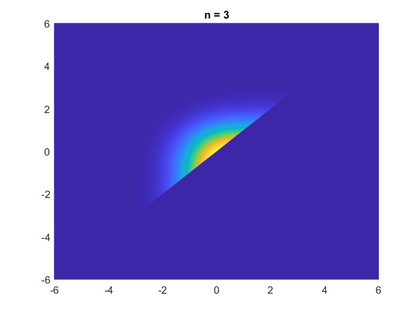
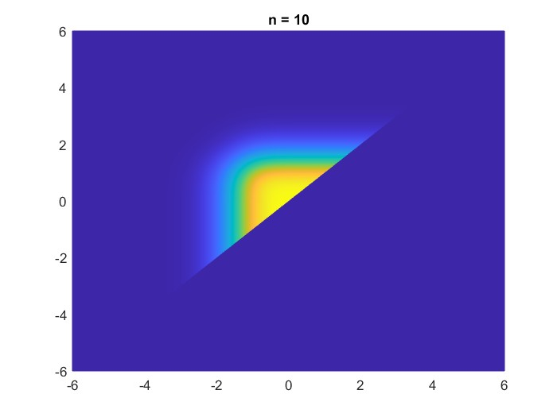
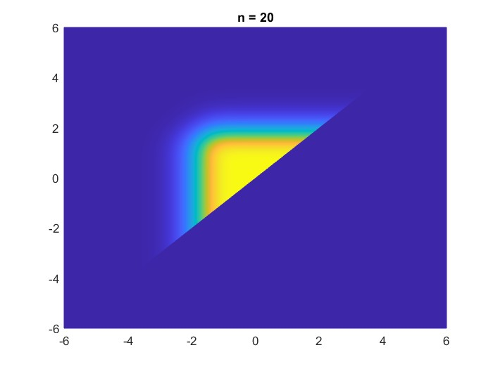

# Description

If you are doing some research on GRR, CPK, SPC or sth, you may meet **Shewhart Constants for Control Charts** many times. (and maybe no one talk about "Shewhart" though) Since every software will calculate the upper/lower limit for you, there is relatively little information on how to calculate the control chart constant. 
So here is about how to use **excel formula (not VBA!!)** to calculate them.

## Type of control chart constant
There are many constant used in the SPC, we can divide them into two group:
1. c4,d2,d3
2. A,A1,A2,A3,B3,B4,B5,B6,D1,D2,D3,D4,E2,E3

*Group 1* is what we need to deal with, and *Group 2* is derived from *Group 1* without any complicated calculations. And for someone is non-statistics major, all you need to know about them is the keyword "anti-biasing constant".

# Definition
## group 1 (troublesome)
$n$ is sample size.

$c_4=\frac{\Gamma{}\left(\frac{n}{2}\right)\sqrt{\frac{2}{n-1}}}{\Gamma{}\left(\frac{n-1}{2}\right)}$

$d_2=\int^{\infty{}}_{-\infty{}}\left\\{1-\left[1-\varphi{}(x)^n\right]-\left[\varphi{}(x)\right]^n\right\\}dx$

$d_3=\sqrt{\int_{-\infty{}}^{\infty{}}\int_{-\infty{}}^{y}f(x,y)dxdy-(d_2)^2}$ ,

where $f(x,y)=1-\left[\varphi(y)\right]^n-\left[1-\varphi(x)\right]^n+\left[\varphi(y)-\varphi(x)\right]^n$

and $\varphi(\cdot)$ is cumulative normal distribution function.

## group 2 (eazzzzy)

When using $3\sigma{}$ line, $k=3$.

### A family: For $\bar{x}$ control chart

$A=\frac{k}{\sqrt{n}}$

$A_2=\frac{k}{d_2\sqrt{n}}=\frac{A}{d_2}$

$A_3=\frac{k}{c_4\sqrt{n}}=\frac{A}{c_4}$

### B family: For $s$ control chart

$B_3=\max{\left(0,1-\frac{k}{c_4}\sqrt{1-{c_4}^2}\right)}$

$B_4=1+\frac{k}{c_4}\sqrt{1-{c_4}^2}$

$B_5=\max{\left(0,c_4-k\sqrt{1-{c_4}^2}\right)}$

$B_6=c_4+k\sqrt{1-{c_4}^2}$

### D family: For $R$ control chart

$D_1=\max{\left(0,d_2-kd_3\right)}$

$D_2=d_2+kd_3$

$D_3=\max{\left(0,1-k\frac{d_3}{d_2}\right)}$

$D_4=1+k\frac{d_3}{d_2}$

### E family: For $X$ control chart (not sure)

$E_2=\frac{k}{d_2}$

$E_3=\frac{k}{c_4}$

# Calculation

## $c_4$

```{excel formula}
=LET(n,A3,
  EXP(GAMMALN(n/2))*(2/(n-1))^0.5/EXP(GAMMALN((n-1)/2))
)
```
It is quite strait forward (simple), since you can observe it by the expression.

## $d_2$

```{excel formula}
=LET(n,A3,_min,-8,_max,8,dx,0.05,
  _v, SEQUENCE(ROUND((_max-_min)/dx,0)+1,1,_min,dx),
  _int,LAMBDA(f,x,SUM(f(x)*dx)),
  _phi,LAMBDA(x,NORM.S.DIST(x,TRUE)),
  _fun,LAMBDA(x,1-POWER(1-_phi(x),n)-POWER(_phi(x),n)),
  _int(_fun,_v)
)
```
Things start to get crazy. `_min` and `_max` represent the upper and lower bound respectively. And the value is decided by when `NORM.S.DIST(x,TRUE)` is smaller than siginificant digits in the single cell of excel. `dx` value is just a random (and small enough) choice, and it produce the result with no more than 1% error even when n=1000.

## $d_3$
where "C3" in the buttom formula is the d2 value calculated by the above formula.
```{excel formula}
=LET(n,A3,_min,-5,_max,5,dx,0.05,L,ROUND((_max-_min)/dx,0)+1,
  _phi,LAMBDA(x,NORM.S.DIST(x,TRUE)),
  f,LAMBDA(x,y,p,1-POWER(p(y),n)-POWER(1-p(x),n)+POWER(p(y)-p(x),n)),
  meshf,LAMBDA(r,c,condi,LET(x,_min+c*dx,y,_min+r*dx,IF(condi,f(x,y,_phi),0))),
  fR,MAKEARRAY(L,L,LAMBDA(r,c,meshf(r,c,r>c)*dx*dx)),
  fL,MAKEARRAY(L,L,LAMBDA(r,c,meshf(r,c,r>=c)*dx*dx)),
  SQRT(SUM(fR,fL)-C3^2)
)
```
While the half of the `MAKEARRAY()` is `0`, it is still more efficient than make an array that the shape are identical to the integration range.
The upper/lower limit here is shown below, as you can see basically when `|x|` or `|y| > 5`, `f(x,y)` is small enough to be ignore.




## Comparison


# Further reading
[deriving d2 and d3](https://qcplanets.com/method/control-chart/r-control-chart-d2-d3/)

[x bar & R chart](https://en.wikipedia.org/wiki/X%CC%85_and_R_chart)

[x bar & s chart](https://en.wikipedia.org/wiki/X%CC%85_and_s_chart)

[R control chart](https://en.wikipedia.org/wiki/Shewhart_individuals_control_chart)
