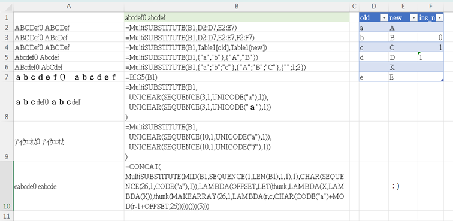

# Comparison
## Parameter
EXCEL ver:
```
SUBSTITUTE(text, old_text, new_text, [instance_num])
```
--> all the parameter is single cell

This ver:
```
MultiSUBSTITUTE(text, old_text, new_text, [instance_num])
```
--> except text, other can be array. **ROW array**

# How to use
[basically is same as EXCEL one.](https://support.microsoft.com/en-gb/office/substitute-function-6434944e-a904-4336-a9b0-1e58df3bc332)
The order is from top to bottom. If the original text is `abc`, and input substitute array look like: 
|old_text|new_text|temp result|
|:--|:--|--:|
|a|b|`bbc`|
|bb|c|`cc`|
|cc|d|`d`|

the resule will be `d`

# warning
* recursive LAMBDA has some limit([ref](https://techcommunity.microsoft.com/t5/excel/lambda-functions-limit-of-iterations/m-p/2056256)), so please don't enter something like this:
```
=MultiSUBTITUTE(A1, D:D, E:E)
```
* yes I tried, EXCEL shut down.

# Example
* B1: the string.
* A2: notice it doesn't replace 0 or space to letter K. And since row 5 is blank, the process stop, e is not replaced by E.
* A3: <br>row blank = replace all<br>row 2: 0 = blank = replace all<br>row 3: 1 = replace first one <br>row 4: string "1" = not number = ignore = replace all
* A4: use table, cool. dynamic, good.
* A5: please make sure input is **row array**. As you can see, a->A is worked, but b->B is not. that is because the function see a xRyC as a xR1C array.
* A6: array-not-stored-in-cell(I don't know how to call them) also work.
* A7: using `BIG5()` or `ASC()` function will replace them all. (It is a nightmare if you have a string include hiragana, alphabet and number all at once)
* A8, A9: by sepecifing section in unicode can avoid this problem
* A10: Just a fancy way to generate caesar code XD


### How to use LAMBDA
[here](https://support.microsoft.com/en-au/office/lambda-function-bd212d27-1cd1-4321-a34a-ccbf254b8b67)
