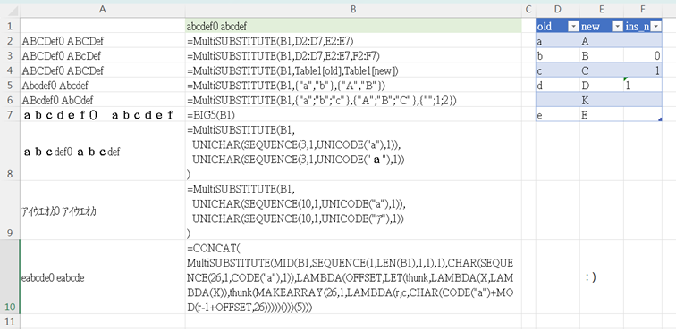

# Description
Excel SUBSTITUTE function for multiple values.

# Comparison
## Parameter
EXCEL ver:
```
SUBSTITUTE(text, old_text, new_text, [instance_num])
```
--> all the parameter is single cell

This ver:
```
MultiSUBSTITUTE(text, old_text, new_text, [instance_num])
```
--> except text, other can be array. **ROW array**

# How to use
Define `PopStackR` first:
```
=LAMBDA(LIST,LET(thunk,LAMBDA(X,LAMBDA(X)),thunks,SCAN("",LIST,LAMBDA(a,b,thunk(MAKEARRAY(ROWS(LIST)-1,1,LAMBDA(r,c,LAMBDA(V,IF(ISBLANK(V),"",V))(INDEX(LIST,r+1,c))))))),IFERROR(INDEX(thunks,1,1)(),"")))
```
Define `MultiSUBSTITUTE`:
```
=LAMBDA(text,old_,new_,[instance_num],IF(EXACT(INDEX(old_,1,1),""),text,IF(ISOMITTED(instance_num),MultiSUBSTITUTE(SUBSTITUTE(text,INDEX(old_,1,1),INDEX(new_,1,1)),PopStackR(old_),PopStackR(new_)),MultiSUBSTITUTE(IF(LAMBDA(V,AND(ISNUMBER(V),V>0))(INDEX(instance_num,1,1)),SUBSTITUTE(text,INDEX(old_,1,1),INDEX(new_,1,1),INDEX(instance_num,1,1)),SUBSTITUTE(text,INDEX(old_,1,1),INDEX(new_,1,1))),PopStackR(old_),PopStackR(new_),PopStackR(instance_num)))))
```

[Basically is same as EXCEL one.](https://support.microsoft.com/en-gb/office/substitute-function-6434944e-a904-4336-a9b0-1e58df3bc332)
The order is from top to bottom. If the original text is `abc`, and input substitute array look like: 
|old_text|new_text|temp result|
|:--|:--|--:|
|a|b|`bbc`|
|bb|c|`cc`|
|cc|d|`d`|

the resule will be `d`

# warning
* recursive LAMBDA has some limit([ref](https://techcommunity.microsoft.com/t5/excel/lambda-functions-limit-of-iterations/m-p/2056256)), so please don't enter something like this:
```
=MultiSUBTITUTE(A1, D:D, E:E)
```
* yes I tried, EXCEL shut down.

# Example
* B1: the string.
* A2: notice it doesn't replace 0 or space to letter K. And since row 5 is blank, the process stop, e is not replaced by E.
* A3: <br>row blank = replace all<br>row 2: 0 = blank = replace all<br>row 3: 1 = replace first one <br>row 4: string "1" = not number = ignore = replace all
* A4: use table, cool. dynamic, good.
* A5: please make sure input is **row array**. As you can see, a->A is worked, but b->B is not. that is because the function see a xRyC as a xR1C array.
* A6: array-not-stored-in-cell(I don't know how to call them) also work.
* A7: using `BIG5()` or `ASC()` function will replace them all. (It is a nightmare if you have a string include hiragana, alphabet and number all at once)
* A8, A9: by sepecifing section in unicode can avoid this problem
* A10: Just a fancy way to generate caesar code XD


# How it works
## pop
```
PopStackR
=LAMBDA(LIST,
  LET(
    thunk,  LAMBDA(X,LAMBDA(X)),
    thunks, SCAN("",LIST,
              LAMBDA(a,b,
                thunk(
                  MAKEARRAY(ROWS(LIST)-1,1,
                    LAMBDA(r,c,LAMBDA(V,IF(ISBLANK(V),"",V))( INDEX(LIST,r+1,c)))
                  )
                )
              )
            ),
    IFERROR(INDEX(thunks,1,1)(),"")
  )
)
```
Why `LET` and `MAKEARRAY` is because that `OFFSET` function somehow doesn't support dynamic array...? (array-not-stored-in-cell).<br>
For instance, 
```
=OFFSET(SEQUENCE(10,1,1,1),5,0,5,1)
```
is expected (at least by me) to output `{6;7;8;9;10}`, but it turn out not even `#VALUE!` but warning you the function is not correct.<br>
While we enter `=SEQUENCE(10,1,1,1)` in `A1` and type `=OFFSET(A1#,5,0,5,1)` it magically worked.<br>
So by the end I have no choice but to copy the whole STACK again.<br>
Also, I learned the thunk trick [here](https://www.flexyourdata.com/blog/what-is-a-thunk-in-an-excel-lambda-function/). He has many good stuff. Highly recommanded.<br>
BTW if you not gonna use dynamic array, this version works as good:
```
  PopListR
  =LAMBDA(LIST,
    IF(ROWS(LIST)<>1,
      OFFSET(LIST,1,0,ROWS(LIST)-1,1),
      ""
    )
  )
```
## sub
```
MultiSUBSTITUTE
=LAMBDA(text, old_, new_, [instance_num],
  IF(EXACT(INDEX(old_,1,1),""),
    text,
    if(ISOMITTED(instance_num),
      MultiSUBSTITUTE(
        SUBSTITUTE(text, INDEX(old_,1,1), INDEX(new_,1,1)),
        PopStackR(old_),
        PopStackR(new_)
      ),
      MultiSUBSTITUTE(
    　  if(LAMBDA(V,AND(ISNUMBER(V),V>0))(INDEX(instance_num,1,1)),
    　      SUBSTITUTE(text, INDEX(old_,1,1), INDEX(new_,1,1), INDEX(instance_num,1,1)),
    　      SUBSTITUTE(text, INDEX(old_,1,1), INDEX(new_,1,1))
    　  ),
    　  PopStackR(old_),
    　  PopStackR(new_),
    　  PopStackR(instance_num)
      )
    )
  )
)
```
Recrusive breaker: if the old_ array start with a blank cell. The reason why I use `EXACT` instead of `ISBLANK` is because I rewrite them all in the `PopStackR` function. And the reason why I replace them is because EXCEL treat 0(value), blank(ommited) and ""(zero length string) in many way and always drives me crazy.

### How to use LAMBDA
[here](https://support.microsoft.com/en-au/office/lambda-function-bd212d27-1cd1-4321-a34a-ccbf254b8b67)
